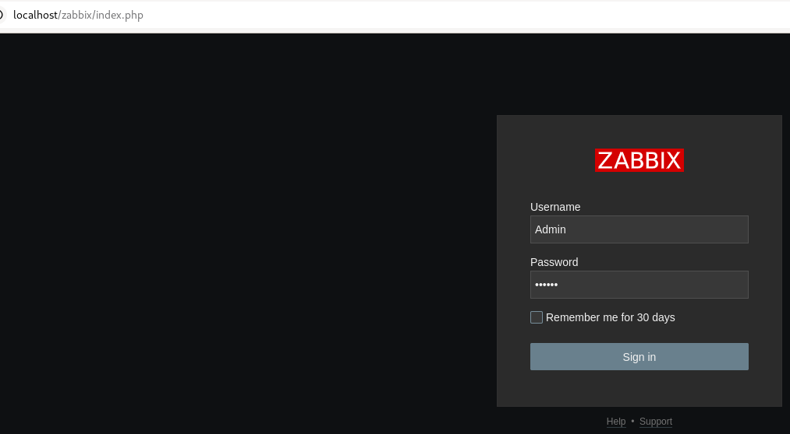
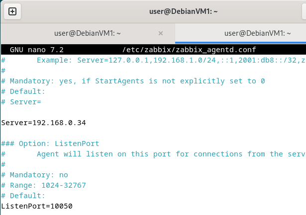
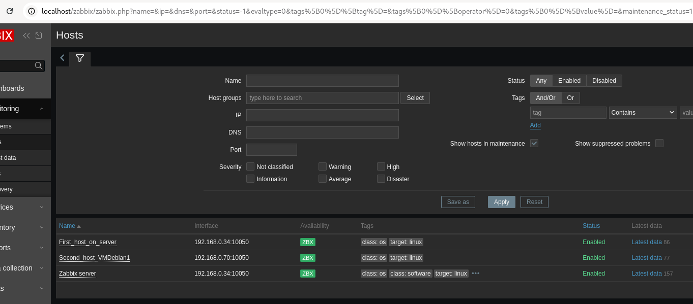
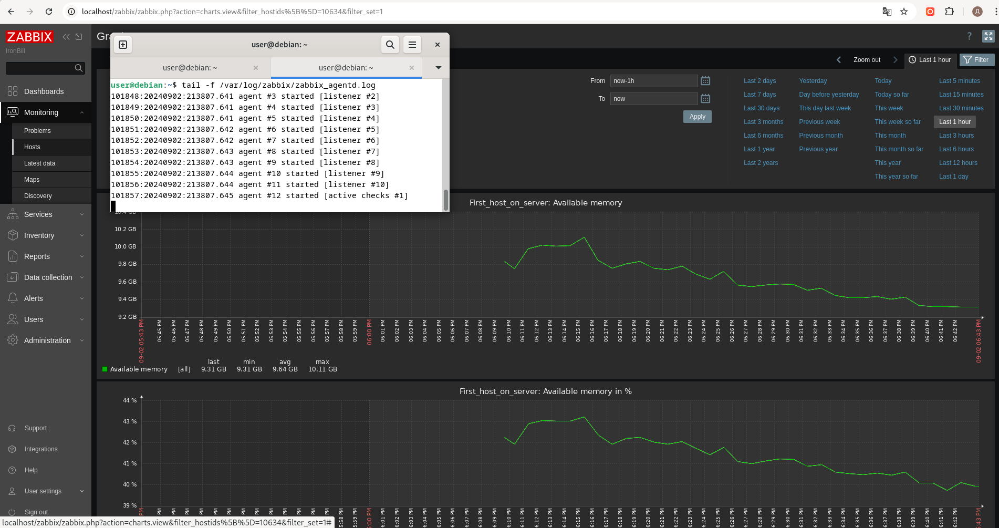
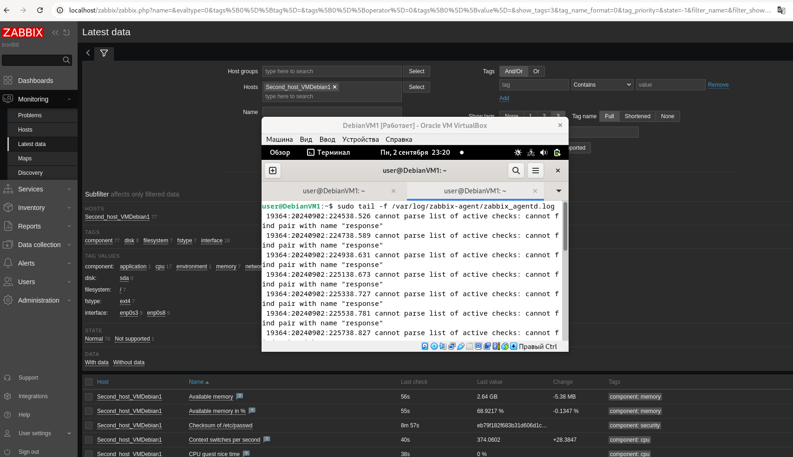
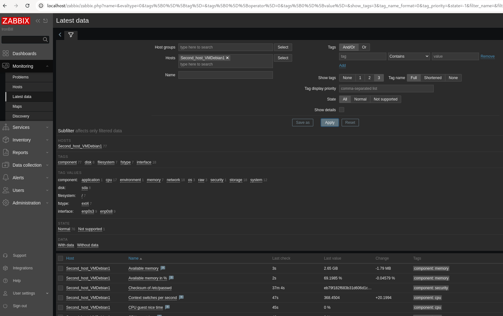

# Домашнее задание к занятию "`Занятие 8-03 Zabbix`" - `Алексеев Александр`


### Инструкция по выполнению домашнего задания

   1. Сделайте `fork` данного репозитория к себе в Github и переименуйте его по названию или номеру занятия, например, https://github.com/имя-вашего-репозитория/git-hw или  https://github.com/имя-вашего-репозитория/7-1-ansible-hw).
   2. Выполните клонирование данного репозитория к себе на ПК с помощью команды `git clone`.
   3. Выполните домашнее задание и заполните у себя локально этот файл README.md:
      - впишите вверху название занятия и вашу фамилию и имя
      - в каждом задании добавьте решение в требуемом виде (текст/код/скриншоты/ссылка)
      - для корректного добавления скриншотов воспользуйтесь [инструкцией "Как вставить скриншот в шаблон с решением](https://github.com/netology-code/sys-pattern-homework/blob/main/screen-instruction.md)
      - при оформлении используйте возможности языка разметки md (коротко об этом можно посмотреть в [инструкции  по MarkDown](https://github.com/netology-code/sys-pattern-homework/blob/main/md-instruction.md))
   4. После завершения работы над домашним заданием сделайте коммит (`git commit -m "comment"`) и отправьте его на Github (`git push origin`);
   5. Для проверки домашнего задания преподавателем в личном кабинете прикрепите и отправьте ссылку на решение в виде md-файла в вашем Github.
   6. Любые вопросы по выполнению заданий спрашивайте в чате учебной группы и/или в разделе “Вопросы по заданию” в личном кабинете.
   
Желаем успехов в выполнении домашнего задания!
   
### Дополнительные материалы, которые могут быть полезны для выполнения задания

1. [Руководство по оформлению Markdown файлов](https://gist.github.com/Jekins/2bf2d0638163f1294637#Code)

---

### Задание 1 Установите Zabbix Server с веб-интерфейсом.
Требования к результаты
    Прикрепите в файл README.md скриншот авторизации в админке.
    Приложите в файл README.md текст использованных команд в GitHub.
`Приведите ответ в свободной форме........`

#### Установка Zabbix
```bash
wget https://repo.zabbix.com/zabbix/7.0/debian/pool/main/z/zabbix-release/zabbix-release_7.0-2+debian12_all.deb
sudo dpkg -i zabbix-release_7.0-2+debian12_all.deb
apt update
sudo apt install zabbix-server-pgsql zabbix-frontend-php php8.2-pgsql zabbix-apache-conf zabbix-sql-scripts zabbix-agent
```

#### Установка Postgresql
```bash
sudo sh -c 'echo "deb https://apt.postgresql.org/pub/repos/apt $(lsb_release -cs)-pgdg main" >/etc/apt/sources.list.d/pgdg.list'
wget --quiet -O - https://www.postgresql.org/media/keys/ACCC4CF8.asc | sudo apt-key add -
sudo apt update
sudo apt install postgresql-16
```

#### Создание роли/пользователя 'zabbix' в кластере Postgresql. Создание БД с владельцем zabbix.
```bash
su - postgres -c 'psql --command "CREATE USER zabbix WITH PASSWORD '\'zabbix\'';"'
su - postgres -c 'psql --command "CREATE DATABASE zabbix OWNER zabbix;"'
```

#### На хосте Zabbix сервера импортируем начальную схему и данные.
```bash
sudo zcat /usr/share/zabbix-sql-scripts/postgresql/server.sql.gz | sudo -u zabbix psql zabbix
```

#### Настроем базу данных для Zabbix сервера. Отредактируем файл /etc/zabbix/zabbix_server.conf
```bash
sed -i 's/# DBPassword=/DBPassword=zabbix/g' /etc/zabbix/zabbix_server.conf
```

#### Запустим процессы Zabbix сервера и агента, и настроем их запуск при загрузке ОС.
```bash
systemctl restart zabbix-server zabbix-agent apache2
systemctl enable zabbix-server zabbix-agent apache2
```




---

### Задание 2 Установите Zabbix Agent на два хоста.

#### 2.1. Выполним установку агента Zabbix на том же хосте, что и сервер (127.0.0.1 - он же - 192.168.0.34) 
#### и внесем в /etc/zabbix/zabbix_agentd.conf информацию о серверах, с которых сервер будет принимать данные
```bash
sudo apt install zabbix-agent -y
sed -i 's/Server=127.0.0.1/Server=127.0.0.1,192.168.0.34'/g' /etc/zabbix/zabbix_agentd.conf
```

#### 2.2. Выполним установку агента Zabbix на виртуальной машине 192.168.0.70/24 (VMDebian1)
```bash
wget https://repo.zabbix.com/zabbix/7.0/debian/pool/main/z/zabbix-release/zabbix-release_7.0-2+debian12_all.deb
sudo dpkg -i zabbix-release_7.0-2+debian12_all.deb
apt update
sudo apt install zabbix-agent -y
```

#### на VMDebian1 (192.168.0.70) в конф. файле агента Zabbix определим доступность адреса сервера 



#### запустим агент Zabbix на хостах
```bash
sudo systemctl restart zabbix-agent
sudo systemctl enable zabbix-agent
```


#### Приложите в файл README.md скриншот раздела Configuration > Hosts, где видно, что агенты подключены к серверу


#### Приложите в файл README.md скриншот лога zabbix agent, где видно, что он работает с сервером



#### Приложите в файл README.md скриншот раздела Monitoring > Latest data для обоих хостов, где видны поступающие от агентов данные.



#### Приложите в файл README.md текст использованных команд в GitHub
---

### Задание 3

`Приведите ответ в свободной форме........`

1. `Заполните здесь этапы выполнения, если требуется ....`
2. `Заполните здесь этапы выполнения, если требуется ....`
3. `Заполните здесь этапы выполнения, если требуется ....`
4. `Заполните здесь этапы выполнения, если требуется ....`
5. `Заполните здесь этапы выполнения, если требуется ....`
6. 

```
Поле для вставки кода...
....
....
....
....
```

`При необходимости прикрепитe сюда скриншоты
`

### Задание 4

`Приведите ответ в свободной форме........`

1. `Заполните здесь этапы выполнения, если требуется ....`
2. `Заполните здесь этапы выполнения, если требуется ....`
3. `Заполните здесь этапы выполнения, если требуется ....`
4. `Заполните здесь этапы выполнения, если требуется ....`
5. `Заполните здесь этапы выполнения, если требуется ....`
6. 

```
Поле для вставки кода...
....
....
....
....
```

`При необходимости прикрепитe сюда скриншоты
`
